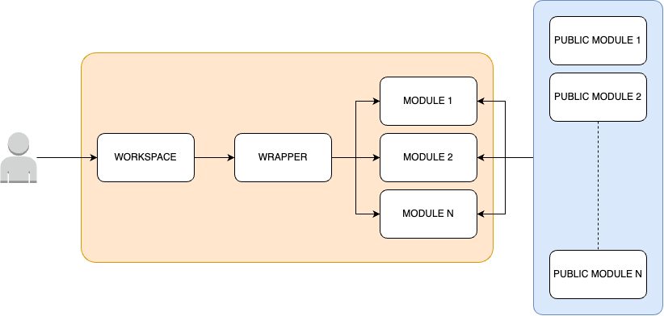

# Infraestructura Reutilizable y Escalable

## Que es este repositorio ?
Este repositorio fue creado como demostración de una forma de escribir módulos de terraform en forma reutilizable.<br/>

Provee un set de herramientas ofrecidas como solucion integral para la implementacion y gestion de infraestructura. Provee templates prearmados, probados y validados para que cualquier operados pueda implementar servicios confiables.<br/>

**Caracteristicas:**
* ⚡️ Implementa infraestructura confiable y alineada a las buenas prácticas.
* 💸 Reduce costosos tiempos de diseño e implementación.
* 💥 Evita errores comunes y vulnerabilidades.


## Estructura de Directorios
Nuestro proyecto de Terraform se organiza en tres directorios principales, cada uno con un propósito específico.
### Directorios:
#### Directorio /workspaces
Este es el punto de partida para los ingenieros cloud en su trabajo diario. Aquí es donde configuran la infraestructura necesaria para diferentes proyectos y ambientes. Piensa en este directorio como el lugar donde se "personaliza" la infraestructura para cada caso específico.

#### Directorio /wrappers
Este directorio actúa como un "intermediario" entre los workspaces y los módulos. Su función principal es:
- Estandarizar las versiones de Terraform y los módulos que se utilizan en toda la empresa.
- Proporcionar una interfaz consistente para que los equipos de toda la organización puedan crear y gestionar recursos de manera uniforme.
- Simplificar el uso de módulos complejos, ofreciendo configuraciones predefinidas y adaptadas a las necesidades de la empresa.

#### Directorio /modules
Aquí es donde se desarrollan los módulos propios de la empresa. Estos módulos pueden:
- Utilizar módulos públicos de Terraform.
- Combinar módulos públicos con recursos adicionales para satisfacer necesidades específicas.
- Crear recursos desde cero cuando sea necesario.

<br/>

<br/>

### ¿Cómo funciona todo junto?
Los ingenieros trabajan principalmente en la carpeta "workspaces", donde configuran la infraestructura necesaria.<br/>
Cuando necesitan un servicio, lo solicitan a través de los "wrappers", que aseguran que todos usen las mismas versiones y estándares.<br/>
Los "wrappers" llaman a los módulos en la carpeta "modules", que son como recetas personalizadas que pueden incluir ingredientes (módulos) públicos o propios.<br/>

### La ventaja de esta estructura es que permite
- Mantener un estándar en toda la organización.
- Adaptar módulos públicos a las necesidades específicas sin tener que modificarlos directamente.
- Centralizar la lógica de creación de recursos, facilitando el mantenimiento y las actualizaciones.


## Estructura de Capas ( layers )
| Capa | Descripción | Scope |
|------|-------------|-------|
| 1. Organization | Servicios globales para todos los ambientes | Cuenta root AWS |
| 2. Base | Servicios fundamentales para un ambiente específico | Cuenta AWS > Ambiente |
| 3. Foundation | Servicios complementarios para un ambiente específico | Cuenta AWS > Ambiente |
| 4. Project | Servicios a nivel de proyecto | Cuenta AWS > Ambiente > Proyecto |
| 5. Workload | Servicios para alojar cargas de trabajo específicas | Cuenta AWS > Ambiente > Proyecto > Workload |

### Capas
#### 1. Organization
La capa Organization define servicios y configuraciones globales que aplican a todos los ambientes y proyectos.<br/>
Existe para centralizar la gestión de recursos compartidos y políticas que afectan a toda la infraestructura de la organización.
```
Servicios:
  * N/A
```

#### 2. Base
La capa Base establece los componentes fundamentales necesarios en un ambiente específico.<br/>
Proporciona la infraestructura básica sobre la cual se construirán las demás capas. Su propósito es crear una base consistente para cada ambiente.<br/>
```
Servicios:
  * VPC
  * Route53
```

---

#### 3. Foundation
La capa Foundation complementa la capa Base con servicios adicionales necesarios para el funcionamiento general del ambiente. Agrega funcionalidades que son comunes a múltiples proyectos dentro del mismo ambiente.<br/>
```
Servicios:
  * ACM ( Cerificados SSL ) ( requiere de DNS )
```

---

#### 4. Project
La capa Project se enfoca en los servicios requeridos por un proyecto específico dentro de un ambiente.<br/>
Existe para agrupar y gestionar recursos compartidos entre diferentes cargas de trabajo del mismo proyecto.<br/>
```
Servicios:
  * Cluster de ECS ( Es donde se van a correr los contenedores )
  * Clusters de RDS ( Base de Datos / Relacional )
  * Servicio ALB ( Balanceador de Carga )
  * Servicio S3
```

---

#### 5. Workload ( carga de trabajo )
La capa Workload representa la implementación de una aplicación o servicio específico.<br/>
Define y configura los recursos directamente relacionados con la ejecución de una carga de trabajo particular, permitiendo su gestión independiente.<br/>
```
Servicios:
  * Contenedores de ECS ( ECS Services / Tasks )
```

---

## Guía de Uso: Proyecto Terraform por Capas

### Requisitos Previos

Antes de comenzar, asegúrate de tener lo siguiente:

1. Repositorio clonado en tu máquina local.
2. Terraform instalado en tu PC.
3. Acceso a una cuenta de AWS con credenciales de administrador (para configurar el provider de Terraform).
4. Una zona DNS disponible (para crear y habilitar una subzona DNS en Route53 en AWS).

### Pasos para Aplicar la Infraestructura

Sigue estos pasos en orden para aplicar las diferentes capas de la infraestructura:

#### 1. Capa BASE

1. Navega al directorio `base/development`.
2. Ajusta el archivo `locals.tf` según sea necesario:
   - Modifica `public_domain` y `private_domain`.
   - Opcionalmente, ajusta las variables `company` y `env`.
   - Si es necesario, modifica `VPC_CIDR`.

Ejemplo de `locals.tf`:

```hcl
locals {
  metadata = {
    aws_region = "us-east-2"
    environment = "Development"
    public_domain  = "democorp.cloud"
    private_domain = "democorp"
    key = {
      company = "dmc"
      region  = "use2"
      env     = "dev"
    }
  }
  common_name = join("-", [
    local.metadata.key.company,
    local.metadata.key.env
  ])
  vpc_cidr = "10.100.0.0/16"
}
```

3. Ejecuta los siguientes comandos:
   ```
   terraform init
   terraform apply
   ```

Resultado: Se crea la VPC, una instancia EC2 para usar como NAT Gateway y la zona de Route53.

#### 2. Capa FOUNDATION

1. Navega al directorio correspondiente.
2. Ajusta el archivo `locals.tf` de manera similar a la capa BASE.
3. Ejecuta:
   ```
   terraform init
   terraform apply
   ```

Resultado: Se crea el certificado de ACM.

#### 3. Capa PROJECT

1. Navega al directorio correspondiente.
2. Ajusta el archivo `locals.tf`.
3. Ejecuta:
   ```
   terraform init
   terraform apply
   ```

Resultado: Se crean el cluster de base de datos (MySQL), cluster de ECS y ALB público.

#### 4. Capa WORKLOAD

1. Navega al directorio correspondiente.
2. Ajusta el archivo `locals.tf`.
3. Ejecuta:
   ```
   terraform init
   terraform apply
   ```

Resultado: Se crea un contenedor de WordPress en el servicio de ECS, los registros DNS y las reglas de Load Balancer para acceder al servicio públicamente.

### Notas Importantes

- Asegúrate de aplicar las capas en el orden especificado.
- Revisa cuidadosamente los cambios propuestos antes de aplicarlos.
- Considera usar variables de entorno o un archivo de variables para manejar configuraciones sensibles.
- Las claves de acceso a la base de datos estan almacenadas dentro del Secrets Managers. Revisar el archivo main.tf en `workspaces/workload/core/development/main.tf` si se quiere acceder a la base de datos sin autenticación.
- Se debe crear la base de datos dentro del phpmyadmin bajo el nombre asignado de la variable "WORDPRESS_DATABASE_NAME" en `workspaces/workload/core/development/main.tf`.

---

## Contacto y Soporte

Para obtener ayuda adicional o reportar problemas, contacte a:
- Email: support@your-company.com
